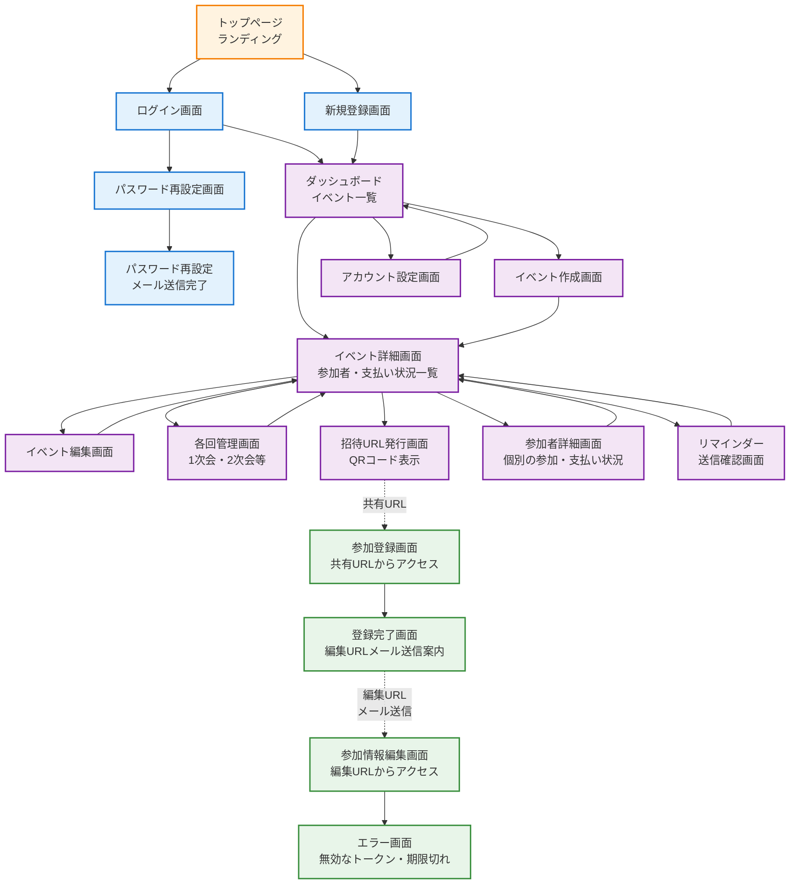

# EventPay Manager 画面遷移図

## 概要
EventPay Managerの全画面と画面遷移を示します。システムは大きく以下の3つのユーザーフローに分かれています：

1. **認証フロー**: ユーザー登録・ログイン
2. **幹事フロー**: イベント管理・参加者管理
3. **参加者フロー**: 参加登録・情報編集

## 画面遷移図

## 画面カテゴリ説明

### 🟦 認証関連画面（青）
- **トップページ**: サービスの説明とログイン・新規登録への導線
- **ログイン画面**: 既存幹事のログイン
- **新規登録画面**: 新規幹事の登録
- **パスワード再設定**: パスワードを忘れた場合の再設定フロー

### 🟪 幹事用画面（紫）
- **ダッシュボード**: 管理中のイベント一覧
- **イベント作成**: 新規イベントの作成
- **イベント詳細**: 参加者一覧と支払い状況の管理
- **イベント編集**: イベント情報の編集
- **各回管理**: 1次会、2次会などの各回設定
- **招待URL発行**: 参加者向けURLとQRコードの生成
- **参加者詳細**: 個別参加者の詳細情報
- **リマインダー**: 未払い者へのメール送信
- **アカウント設定**: 幹事アカウントの設定

### 🟩 参加者用画面（緑）
- **参加登録画面**: 共有URLからアクセスし、参加情報を登録
- **登録完了画面**: 登録完了と編集URL送信の案内
- **参加情報編集画面**: 編集URLから参加情報を編集
- **エラー画面**: トークン無効・期限切れの場合

## 特徴的な遷移パターン

### 1. URL経由のアクセス（点線）
- 幹事が発行した**共有URL**から参加登録画面へ
- メールで送信される**編集URL**から参加情報編集画面へ

### 2. トークンベース認証
- 参加者は登録不要でトークンによる認証
- トークンは7日間有効
- 期限切れの場合はエラー画面へ遷移

### 3. 循環的な管理フロー
- イベント詳細を中心に各種管理画面へ遷移
- 各管理画面からイベント詳細へ戻る設計

## 実装上の注意点

1. **認証の違い**
   - 幹事: Rails 8標準認証（セッションベース）
   - 参加者: トークンベース認証（登録不要）

2. **セキュリティ**
   - 共有URLと編集URLは異なるトークンを使用
   - トークンは暗号化して保存

3. **ユーザビリティ**
   - 参加者は登録不要で簡単に参加可能
   - 幹事は一元的にイベントを管理可能