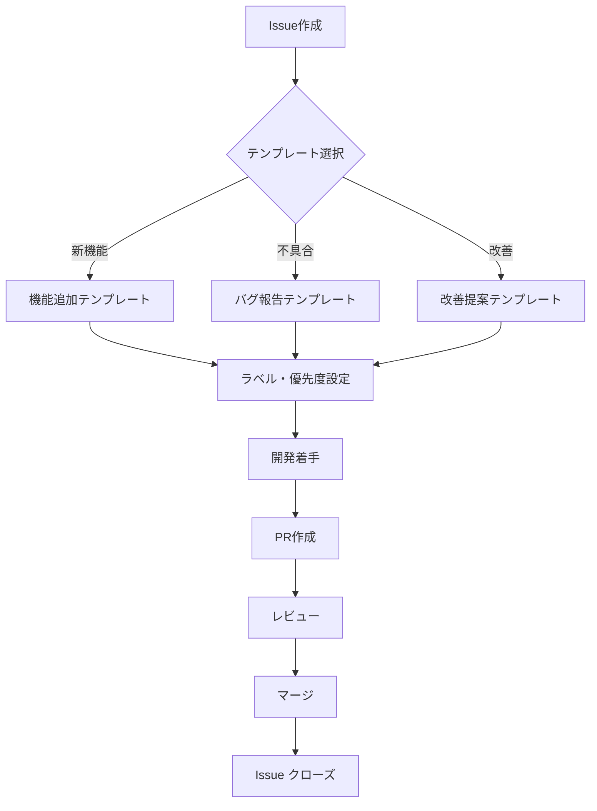

# GitHub Issue テンプレート

## 概要
EventPay Managerでは、効率的な課題管理のために3つのIssueテンプレートを用意しています。テンプレートを使用することで、必要な情報を漏れなく記載し、開発チーム全体でのコミュニケーションを円滑にします。

## 🤖 Claude Code による Issue 自動詳細化機能

### 概要
簡易的に作成したIssueに `needs-details` ラベルを付けると、Claude Codeが自動的に詳細な情報を追加してIssueを更新します。

### 使い方
1. **簡易的なIssue作成**
   ```bash
   # CLIで簡単なタイトルと説明でIssue作成
   gh issue create --title "ユーザー認証機能を追加" --body "Googleログインを実装したい"
   ```

2. **ラベル付与で自動詳細化**
   ```bash
   # needs-detailsラベルを付与（Issue番号は作成時に取得）
   gh issue edit <issue-number> --add-label "needs-details"
   ```

3. **自動的に詳細化される内容**
   - 技術的詳細（使用技術、実装方針）
   - 実装ステップ（段階的なタスク分解）
   - 受け入れ基準（テスト可能な完了条件）
   - セキュリティ・パフォーマンス考慮事項
   - 推奨ラベル・優先度の提案

### 詳細化の例
**Before（簡易的なIssue）:**
```
タイトル: ユーザー認証機能を追加
本文: Googleログインを実装したい
```

**After（Claude Codeによる詳細化）:**
```markdown
## 📋 概要
Google OAuth 2.0を使用したソーシャルログイン機能を実装し、ユーザーの登録・ログインプロセスを簡素化します。

## 🎯 目的・背景
現在はメール+パスワードのみの認証方式ですが、ユーザビリティ向上のため...

## 📐 技術的詳細
### 実装方針
- omniauth-google-oauth2 gemを使用
- Rails 8.0の標準認証と統合...

[以下、詳細な実装ステップ、受け入れ基準等が続く]
```

## 利用可能なテンプレート

### 🚀 機能追加（Feature Request）
新しい機能の追加要求に使用します。MVP以降のPhase別実装や、実装カテゴリに基づいた分類が可能です。

**適用場面：**
- 新機能の提案
- MVP Phase 2-4の機能実装
- 外部サービス連携の追加

**ラベル：** `enhancement`, `feature`

### 🐛 バグ報告（Bug Report）
システムの不具合や予期しない動作の報告に使用します。

**適用場面：**
- アプリケーションエラー
- UI/UXの表示崩れ
- 機能の異常動作

**ラベル：** `bug`

### 💡 改善提案（Improvement）
既存機能の改善や最適化の提案に使用します。

**適用場面：**
- パフォーマンスの改善
- UI/UXの改善
- セキュリティの強化

**ラベル：** `enhancement`, `improvement`

## GitHub CLI（gh）での利用方法

### 基本的な使い方

```bash
# インタラクティブに選択
gh issue create

# 特定のテンプレートを指定
gh issue create --template feature_request.md
gh issue create --template bug_report.md
gh issue create --template improvement.md
```

### 高度な使い方

```bash
# タイトルとラベルを同時に指定
gh issue create --template feature_request.md --title "[機能追加] Google認証の実装" --label "enhancement,feature,phase-2"

# アサイン先を指定
gh issue create --template bug_report.md --assignee "@me"

# マイルストーンを指定
gh issue create --template improvement.md --milestone "v1.1.0"
```

## MVP以降の実装アイテム

### Phase 2: 利便性向上（MVP + 1〜2ヶ月）

#### 認証機能の拡張
- [ ] Google認証の実装（OAuth 2.0）
- [ ] LINE認証の実装
- [ ] ソーシャルログインの統合UI

#### UI/UX改善
- [ ] プログレッシブWebアプリ（PWA）化
- [ ] レスポンシブデザインの改善
- [ ] ダークモード対応
- [ ] 多言語対応（英語）

#### データ出力機能
- [ ] 参加者一覧のCSV出力
- [ ] 支払い状況のExcel出力
- [ ] イベント詳細のPDF出力

#### リアルタイム機能
- [ ] WebSocketによるリアルタイム更新
- [ ] プッシュ通知機能
- [ ] リアルタイム参加者数表示

### Phase 3: 拡張機能（MVP + 3〜4ヶ月）

#### 会計機能拡張
- [ ] 領収書自動生成機能
- [ ] 会計レポート機能
- [ ] 予算管理機能
- [ ] 割り勘計算の詳細化

#### 定期イベント機能
- [ ] 定期開催イベントのテンプレート
- [ ] 自動リマインダー機能
- [ ] 参加履歴の管理

#### カレンダー連携
- [ ] Googleカレンダー連携
- [ ] Outlookカレンダー連携
- [ ] iCalファイル出力

### Phase 4: エコシステム構築（MVP + 6ヶ月〜）

#### API機能
- [ ] REST API の公開
- [ ] API認証システム
- [ ] レート制限機能
- [ ] API ドキュメントの自動生成

#### 外部サービス連携
- [ ] Slack連携（通知・ボット）
- [ ] Discord連携
- [ ] LINE Bot機能
- [ ] Webhook機能

#### エンタープライズ機能
- [ ] 組織管理機能
- [ ] 権限管理システム
- [ ] 監査ログ機能
- [ ] SSO（Single Sign-On）対応

## Issue作成時のベストプラクティス

### 1. 適切なテンプレートの選択
- 新機能 → **機能追加**テンプレート
- 不具合 → **バグ報告**テンプレート  
- 既存機能の改善 → **改善提案**テンプレート

### 2. 詳細な情報の記載
- 再現手順は具体的に
- 期待される動作と実際の動作を明記
- 環境情報（ブラウザ、デバイス）を記載

### 3. 適切なラベル付け
```bash
# Phase別ラベル
phase-2, phase-3, phase-4

# 機能別ラベル
auth, ui/ux, api, payment, notification

# 優先度ラベル
priority-high, priority-medium, priority-low
```

### 4. 明確な受け入れ基準
- 機能が完成したと言える条件を具体的に記載
- テスト可能な形で記述

## GitHub Issue ワークフロー



## トラブルシューティング

### ghコマンドでテンプレートが表示されない場合
```bash
# リポジトリの同期
gh repo sync

# 最新の状態を取得
git pull origin main

# キャッシュのクリア
gh auth refresh
```

### テンプレートが正しく表示されない場合
1. `.github/ISSUE_TEMPLATE/` ディレクトリの確認
2. YAMLフロントマターの文法チェック
3. ファイル名の確認（拡張子は`.md`）

## 関連ドキュメント
- [GitHub環境構築](github-setup.md)
- [GitHub ワークフロー](github-workflow.md)
- [Claude Code自動ワークフロー](claude-code-workflow.md)
- [画面遷移図](screen-flow.md)
- [開発ルール](development-rules.md)